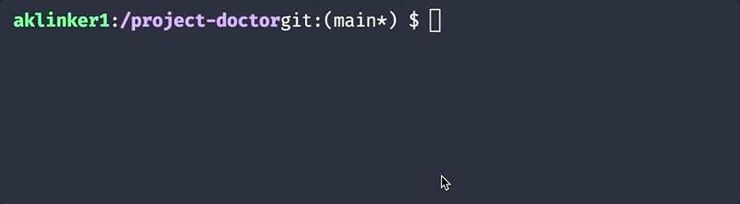

<h1 align="center">👩‍⚕️ Project Doctor 🧑‍⚕️</h1>

<p align="center">The beautiful new way to <strong>validate</strong>, <strong>setup</strong>, and <strong>document</strong> a project's local dev environment!</p>
<p align="center"><i>✨ Inspired by <code>flutter doctor</code> ✨</i></p>

```yaml
checks:
  # Validate executables are in your path
  - preset: node
    version: 14
  # Run custom scripts
  - type: script
    description: Ensure AWS is installed and logged in
    run: aws sts get-caller-identity
  # And more!

# Document useful commands
commands:
  - name: Install dependencies
    run: ["npm i", "npm install"]
  - name: Start server locally with hot-module-reloading (HMR)
    run: npm run dev
  - name: Run Unit Tests
    run: ["npm test", "npm test:watch"]
```

Running `doctor` will:

- Run a series of checks against your local environment, such as:
  - Standardized presets to setup entire dev environments/languages
  - Make sure executables are in your path (or install them if they're not)
  - Run custom shell scripts
  - Ensure local services are installed and running (like PostgreSQL or Redis)
  - Create and fill out gitignored files based on templates
- Print useful commands new developers can explore to get started



### Roadmap

- [x] ~~_Validate or install tools_~~ `v1.0.0`
- [x] ~~_Print getting started commands_~~ Not released
- [ ] Configure gitignored files
- [ ] Envrionment/language presets

#### Why not just containerize?

Not all projects can be built in docker containers, like iOS apps, and others can be hard to setup. Other times you're working on a simple project and dockerizing it is just overkill.

I was tired of writing docs about setting up projects for local development, or troubleshooting someone elses machine when those docs get out of date. With `doctor`, all that is rolled up into a single tool that needs to be installed and single configuration file that is easy to maintain as projects grow/change.

## Installation

Download and run the installer script to install the `doctor` command:

<!-- One line installers stolen from docker-compose -->

```bash
sudo curl -L "https://github.com/aklinker1/project-doctor/releases/download/latest/doctor-$(uname -s)-$(uname -m)" \
  -o /usr/local/bin/doctor
```

> You can download specific versions of `doctor` by replacing `latest` with `vX.Y.Z` in the URL

## Configuration

Use `doctor -h` or `doctor <command> -h` to get documentation about how to use the CLI.

### Config File

By default, `doctor` will look for a file named `doctor.config.yml`, `doctor.config.yaml`, or `doctor.config.json` in your working directory. If it can't find one of those files there, it will recursively go up the file tree until it finds one.

To specify a different configuration file, use `doctor -c path/to/config`.

### Editor Support

If you're using an editor that supports JSON/YAML schemas, you can setup error detection and autocomplete.

You don't have to setup this up though, the first thing `doctor` does is validate your config against a schema, so you'll know if you did something wrong.

#### JSON

Just add the "`"$schema"` field to your config

```jsonc
// doctor.config.json
{
  "$schema": "https://raw.githubusercontent.com/aklinker1/project-doctor/main/cmd/config/schema.json"
  // ...
}
```

#### YAML

Editors don't have a standard way of using schemas for YAML files like JSON. Instead, it's editor dependent

##### VS Code

```jsonc
// settings.json
{
  "yaml.schemas": {
    "https://raw.githubusercontent.com/aklinker1/project-doctor/main/cmd/config/schema.json": "path/to/doctor.config.yml"
  }
}
```

## Contributing

Yes, this repo uses `doctor` for it's local setup as well!

```bash
# Clone the repo
git clone <your-fork>
cd <your-fork>

# Install and setup your local environment
doctor
```
